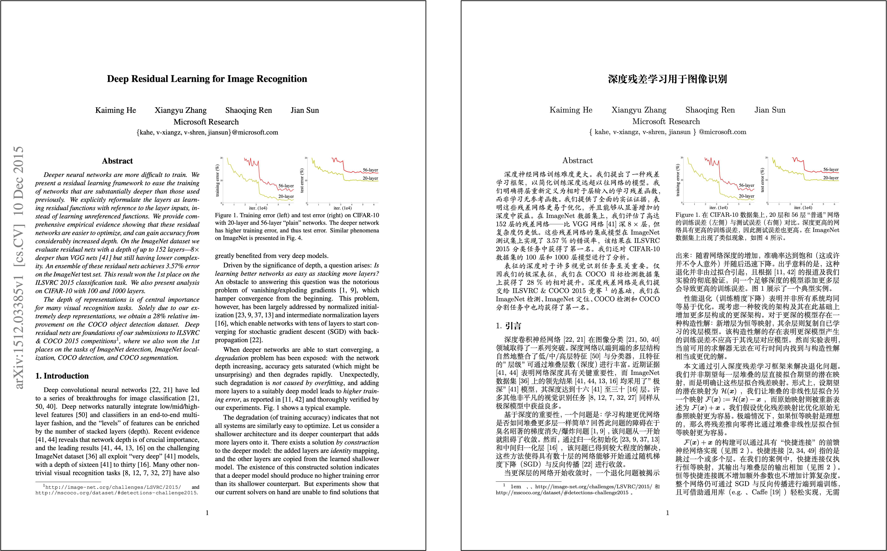
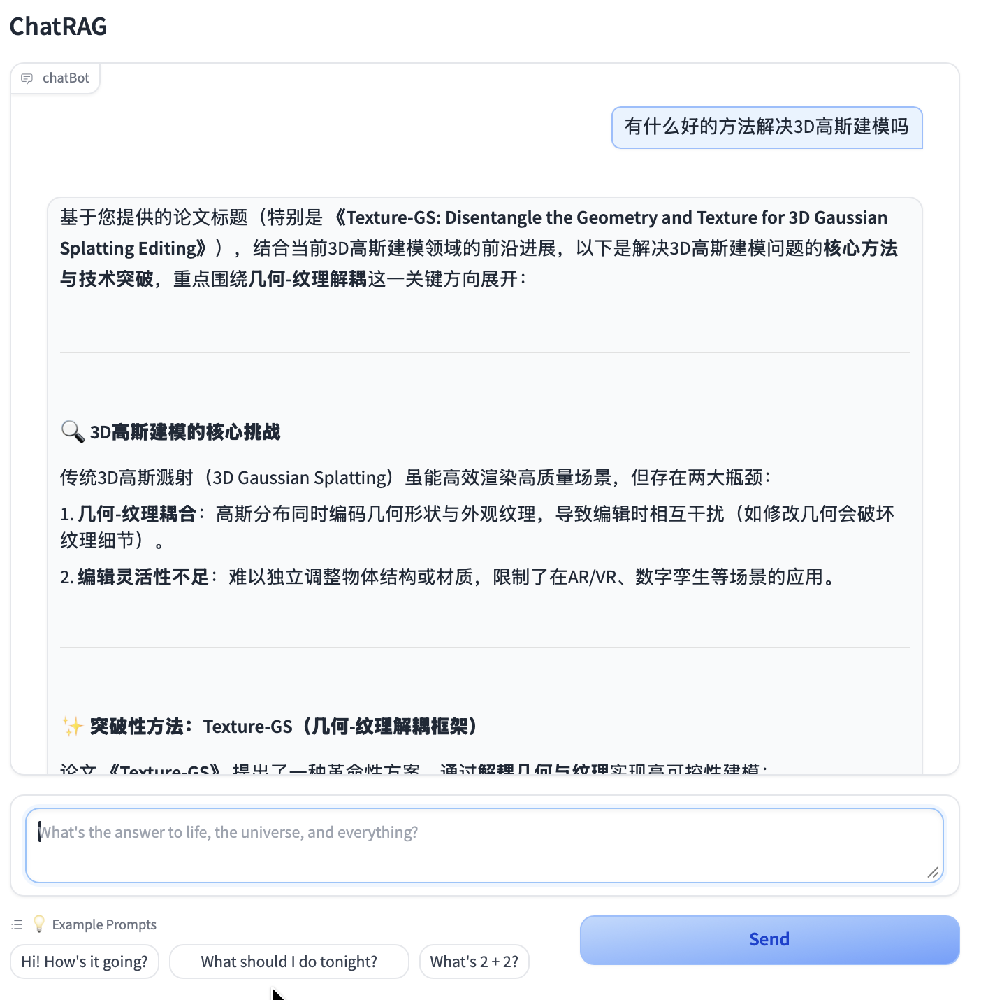

<div align="center">


<h2 id="title">PaperRAG</h2>

</div>

<p align="center">
基于 <a href="https://github.com/choucisan/TranslaTex" target="_blank">TranslaTex 项目</a>，增加了 RAG（检索增强生成）功能，实现论文的智能检索与问答。<br>
</p>

---

<h2 id="功能亮点">✨ 主要功能</h2>

- 📝 支持翻译 `.tex` 文件及 arXiv 论文源码，自动本地编译生成 PDF，方便快速阅读与修改
- 🔍 收录超过3万篇计算机视觉领域顶会论文摘要（CVPR、ICCV、ECCV），支持语义检索与智能问答
- 🤖 集成 RAG（Retrieval-Augmented Generation）技术，结合知识库检索与大语言模型，实现上下文相关的高质量论文内容生成
- 🖥️ 采用 Gradio 打造简洁直观的图形界面，操作简单，界面友好，支持交互式论文查询与翻译

---

<h2 id="界面展示">🖼️ 界面预览</h2>

### 论文翻译

<div align="center">

</div>

### RAG 论文检索

<div align="center">

</div>


## 🚀 快速开始

### 1. 克隆项目

```bash
git clone https://github.com/choucisan/TranslaTex.git
cd TranslaTex
```

### 2. 安装latex
```bash
xelatex --version
bibtex --version
```

### 3. 启动图形界面

```bash
python app.py
```

📧 [choucisan@gmail.com]


