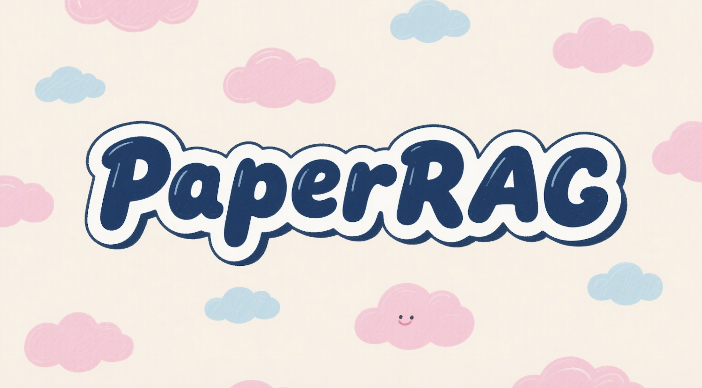
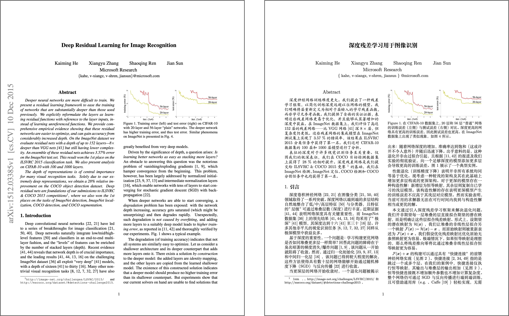
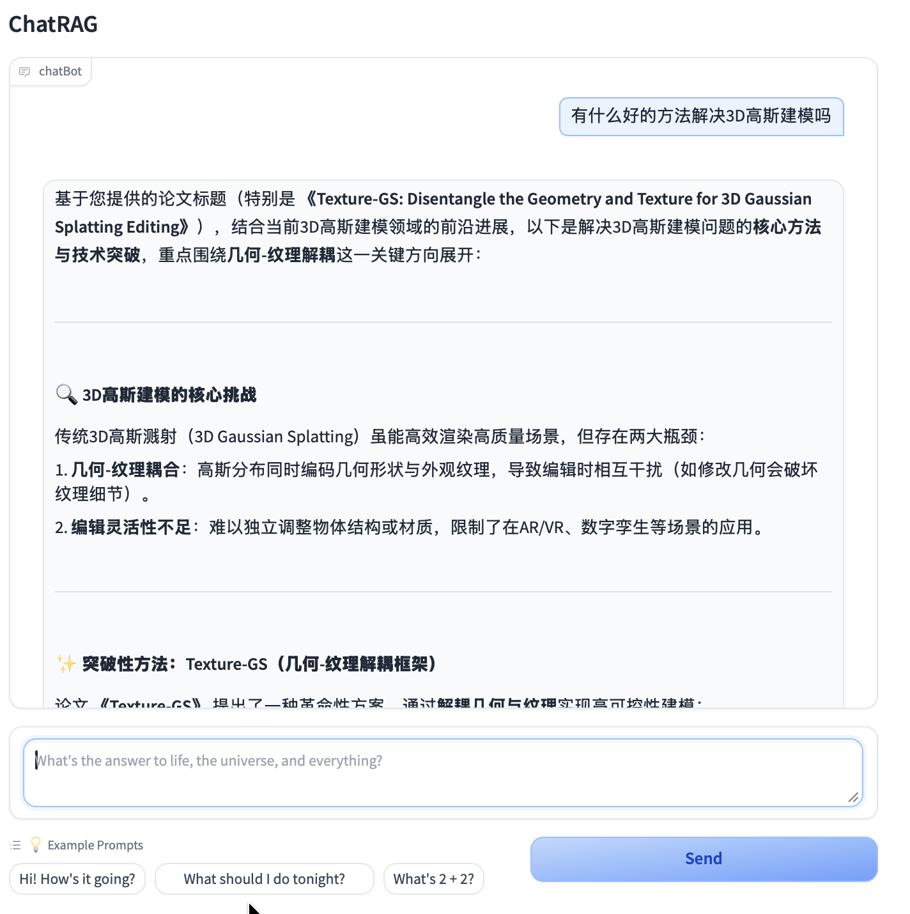

<div align="center">



<h2 id="title">PaperRAG</h2>

</div>

<p align="center">
Based on the <a href="https://github.com/choucisan/TranslaTex" target="_blank">TranslaTex project</a>, this version adds RAG (Retrieval-Augmented Generation) functionality, enabling intelligent paper retrieval and Q&A. <br>
</p>

---

<h2 id="features">✨ Key Features</h2>

- 📝 Supports translating `.tex` files and arXiv paper source codes, with automatic local PDF compilation for fast reading and editing  
- 🔍 Contains over **30,000 abstracts** from top computer vision conferences (CVPR, ICCV, ECCV), enabling semantic retrieval and intelligent Q&A  
- 🤖 Integrated **RAG (Retrieval-Augmented Generation)** technology: combines knowledge-base retrieval with large language models to provide high-quality, context-aware paper content generation  
- 🖥️ Built with **Gradio**, offering a clean and intuitive graphical interface for interactive paper search and translation  

---

<h2 id="ui">🖼️ Interface Preview</h2>

### Paper Translation

<div align="center">

</div>

### RAG Paper Retrieval

<div align="center">

</div>

---

## 🚀 Quick Start

### 1. Clone the Project

```bash
git clone https://github.com/choucisan/TranslaTex.git
cd TranslaTex
```

### 2. Install LaTeX
```bash
xelatex --version
bibtex --version
```

### 3. Launch the GUI

```bash
python app.py
```

📧 [choucisan@gmail.com]


